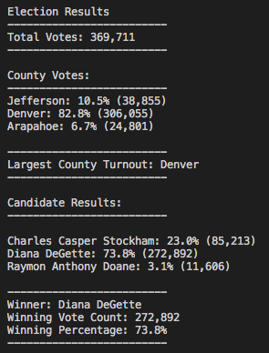
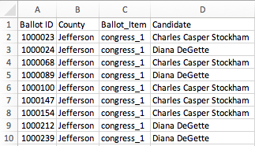
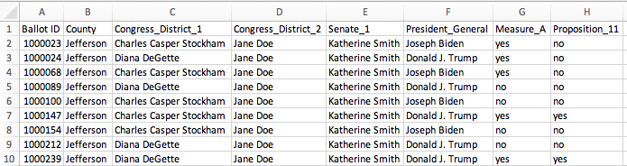

# Election Analysis of Colorado's 1st Congressional District


## Overview of Election Audit
A Colorado Board of Elections employee, Tom, was given the tasks to complete an audit of a recent election for Colorado's 1st Congressional District. This district contains spans Denver and parts of Arapahoe and Jefferson counties.

Normally, completed in Excel, Tom's boss, Sam, wants to know if this can be done in Python.  If so, the code written for this election will be used for other, larger elections. 

Certifying this election includes the following tasks: 
1. Calculate the total number of votes cast.
2. Get a complete list of candidates who received votes.
3. Calculate the total number of votes each candidate received.
4. Calculate the percentage of votes each candidate received.
5. Determine the winner of the election based on the popular vote.

In addition, Sam would like an audit of the voter turnout by county. Specifically, he would like Tom to report on: 

* the voter turnout for each county (i.e. *total votes cast per county*),
* the percentage of all votes cast from each county, and
* the county with the highest turnout overall.

## Resources
The votes cast for this election were done so through 3 primary voting methods: 

1. Mail-in Ballots: *hand-counted*
2. Punchcards: *machine-counted*
3. Direct Recording Electronic reading machine: *computer-counted*

The results of these sources can be found in the comma delimited file, 
**election_results.csv**, located in the Resources folder of this repository.  The data set includes: Ballot ID, County, and Candidate.

The software used, Python version 3.7.6 along with the code editor, Visual Studio Code version 1.49.3.

Let's see what we find....

## Election-Audit Results
The analysis of the election data shows that:

### **Overall Voter Turnout** 

* There were **369,111** votes cast in this election. The total votes was calculated after reading in the .csv file, initializing the variable total_votes to 0 and looping through the data adding a vote for each row read in:
 

```
# Read the csv and convert it into a list of dictionaries with open(file_to_load) as election_data:
    reader = csv.reader(election_data)

    # Read the header; skips the header row
    header = next(reader)

    # For each row in the CSV file
    for row in reader:

        # Add to the total vote count; one method:total_votes = total_votes + 1, or
        total_votes +=1         
```

### **Voter Turnout by County**
* Votes were cast in the following counties: Arapahoe, Denver, Jefferson.  
 
* The code written to identify the counties the voters reside and tally the vote count per county:

	    # Decision statement that checks the county does not match any existing county in the county list.
        if county_name not in county_options:

            # Add the existing county to the list of counties.
            county_options.append(county_name)

            # Begin tracking the county's vote count.
            county_vote_dict[county_name] = 0

        # Add a vote to that county's vote count.
        county_vote_dict[county_name] += 1
        
 
       
County results in alphabetical order:

1.  **Arapahoe County** had **24,801** votes cast representing **6.7%** of the vote. 
2.  **Denver County** had **306,055** votes cast representing **82.8%** of the vote.
3.  **Jefferson County** had **38,855** votes cast representing **10.5%** of the vote.

* The code written to calculate the **percentage of total votes cast per county** as well as identify the county with the largest turnout, as reported above, is as follows:
               	
		# Repetition statement to get the county from the county dictionary.
		for county_name in county_vote_dict:        
				
			# Retrieve the county vote count; using new variable county_votes
			county_votes = county_vote_dict[county_name] 

       		# Calculate the percent of total votes for the county; using new variable county_percentage
       		county_percentage = float(county_votes) / float(total_votes) * 100
       		
       		# Decision statement to determine the winning county and get its vote count.
        	if (county_votes > county_tally):
            	county_tally = county_votes
            	county_lrgturnout = county_name

* The county with the largest voter turnout is clearly **Denver County** with **306,055** votes cast.


### **Candidate Results**

* Votes were cast for three (3) candidates: Diana DeGette, Raymon Anthony Doane, and Charles Casper Stockham.  The code used to identify the candidates and how many votes each candidate won is as follows:

         # If the candidate does not match any existing candidate add it to the candidate list
         if candidate_name not in candidate_options:
          
            # Add the candidate name to the candidate list.
            candidate_options.append(candidate_name)

            # And begin tracking that candidate's voter count.
            candidate_votes[candidate_name] = 0

        # Add a vote to that candidate's count
        candidate_votes[candidate_name] += 1 
               
Candidate results in alphabetical order:  

1. **Diana DeGette** recieved **272,892** votes representing **73.8%** of the vote.
2. **Raymon Anthony Doane** recievd **11,606** votes representing **3.1%** of the vote.
3. **Charles Casper Stockham** recieved **85,213** votes representing **23.0%** of the vote.  

* The code written to calculate the **percentage of total votes won** by each candidate, as reported above, is as follows:
    

        # To calculate the percentage total votes won
        for candidate_name in candidate_votes:
        
        	# Retrieve vote count and percentage for each candidate
        	votes = candidate_votes.get(candidate_name)
        	vote_percentage = float(votes) / float(total_votes) * 100

	
* Clear winner of the election: **Diana DeGette** who won **73.8%** of the votes.


### Code Ouput
The Python code calls for these summary results to output to the terminal view as well as to a text file, named **election_analysis.txt** also included in this repository.  Please see the terminal screenshot below.  

**Screenshot of terminal output for Python code: PyPoll_Challenge.py**



## Election-Audit Summary
 
As the code is written, it reads in the names of the counties and the candidates rather than have the names hardcoded (see previous code blocks).  This allows the code to work regardless of which county or which candidates are involved in the election being audited.  It is flexible and dynamic in that way. Bottom line, this code works beautifully for an isolated race like this one, and with modifications it can be applied to any race that has the same input file structure.  

### Code Modification
Here are some modification suggestions to make the code even more adpatable to any election.

**Modification 1:** Any single item on a ballot can be audited using this code as long as there are three data items:

* a unique Ballot ID,
* a description of the registrant (geography, age, political affiliation) and 
* a vote, whether it be in the form of candidate names or a "yes"/"no" vote for Measures and Propositions.

The variable, list, and dictionary names can be redefined within the code to reflect the different election characteristics, but the analysis need not change.

For example: 

* County could be changed to School District for a School Board election
			county_name => school_dist_name
* Candidate could be changed to Yes/No for a proposition or measure election
			candidate_name => yes_no
* County can be changed to Political Party for a measure to audit which political party cast more votes for that initiative.
		county => pol_party

In fact, take it a step further and define these variables, lists, and dictionaries using broader labels, like vote_description and vote_response. No code updates necessary, just an understanding of the source data. 

**Modification 2:**  The summary of the output is a list of "f" strings with variables interjected, which makes modifying the output to be more specific to the election simple. Either updating the string directing or creating a variable to identify the race can be included in the summary output.  Original code for the total votes cast: 

       
    # Print the final vote count (to terminal)
    election_results = (
        f"\nElection Results\n"
        f"-------------------------\n"
        f"Total Votes: {total_votes:,}\n"
        f"-------------------------\n\n"
        f"County Votes:\n"
        f"-------------------------\n"))
  
      
By combining Modification 1 (modifying the variable, list, and dictionary names) and Modification 2 (defining a race_ID variable), the output summary could look something like this:
```# Print the final vote count (to terminal)

    	election_results = (
        	f"\nElection Results {race_ID}\n"  
        	f"-------------------------\n"  
        	f"Total Votes: {total_votes:,}\n"  
        	f"-------------------------\n\n"  
        	f"County Votes:\n"  
        	f"-------------------------\n"))```
        	

**Modification 3:** Unless the input file is located in the same folder with the same name, the ```file_to_load``` statement will need to be modified to ensure the correct data is being read in.		

**Visualization modification:** The output could be easier to read by ***sorting the results in descending order*** to show winning result on top, rather than outputting in the order the list is created (i.e. the result of how the candidate_options and county_options lists are created).

### Next Steps
If loading separate files for each race is too cumbersome, what if we wanted to expand the code to be able to read multiple elections from one file? As it is written, the code reflects and is **limited by the input data**. While the code can be run for any race, it can only be run for one (1) race at a time. 

Additional input data is required to increase the scope of these audits, and ***as the scope of input increases, the code changes to adapt*** to the different scenarios.  

1. All votes cast for all races in one field, as we see here, then an additional field would be needed to distinguish between the different races, a ballot item identifier.  Something more like:



In which case, the code would have to be modified to read in each of the Ballot Items and run the code for each of the races in nested loops.  But this would be very cumbersome

OR

2. Each Ballot Id is a unique entry with each of the possible Ballot Items being a separate field.  Something like:


This would be a cleaner format for the election data and ultimately easier to analyze.  With sample input data like this, one initial change in the code would be to ***utilize the variable, header***. In the current code, the statement ```header = next(reader)``` is used to basically advance the file reader to the second line of data to start reading in the election results. With the expansion of the input data, **the "header" variable can dynamically determine the keys for each dictionary representing each election item**. 

As the data is expanded, the scope of this current code needs to as well; but the good news is that Python is very capable of handling these larger projects.